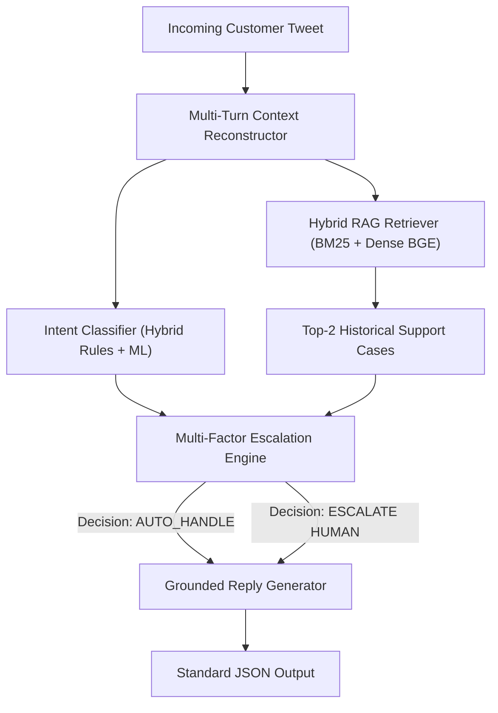

# Grounded AI Customer Support Agent for AmazonHelp
### Hiver SDE Intern Take-Home Assignment

[](https://www.python.org/downloads/)
[](https://opensource.org/licenses/MIT)
[](https://github.com/qdrant/fastembed)
[](https://docs.pytest.org/)

An end-to-end, trustworthy AI Customer Support Agent built for **AmazonHelp** using real conversation data from Kaggle's *Customer Support on Twitter* dataset (~2.81M tweets).

The agent:
1. **Classifies incoming customer messages** into an 8-class domain intent taxonomy.
2. **Drafts grounded replies** conditioned on retrieved historical resolutions and official policy portals.
3. **Makes deterministic auto-handle vs. human escalation decisions** with explicit, audited reasons.
4. **Is rigorously benchmarked** against two baselines (Trivial & Simple) on a 200-example hand-labelled Golden Evaluation Set with an automated LLM-as-a-Judge rubric and human expert agreement validation.

---

## 1. Quickstart: Reproduce Headline Results (< 2 Minutes)

> [!NOTE]
> **Preprocessed Artifacts Included:** The raw Kaggle dataset (`archive.zip` / `twcs.csv`, ~500MB+) is intentionally not committed to the repository for size and licensing reasons. All preprocessed conversation threads, retrieval knowledge base splits, search indices, and the 200-example Golden Evaluation Set are pre-built and committed in `data/processed/`, `data/models/`, and `evaluation/`.
> Reviewers can reproduce the headline benchmarks in under 2 minutes without downloading raw Kaggle files or rebuilding indices.

### Primary Reproduction Path (Fast Track: Clone → Install → Evaluate)

#### Step 1: Clone and Navigate
```bash
git clone https://github.com/Anmol1578/hiver-sde-assignment.git
cd hiver-sde-assignment
```

#### Step 2: Set Up Virtual Environment & Dependencies
```bash
# Windows
python -m venv .venv
.venv\Scripts\activate

# macOS / Linux
python3 -m venv .venv
source .venv/bin/activate

# Install dependencies (standard pip or uv)
pip install -r requirements.txt
```

#### Step 3: Run Evaluation Harness
Executes the complete evaluation suite across the Trivial Baseline, Simple Baseline, and Production AI Agent on the 200-example Golden Evaluation Set:
```bash
python -m evaluation.run_eval
```
*(Execution time: ~2 seconds. Displays the comparative metrics table and refreshes `evaluation/eval_results.json` and `evaluation/eval_summary.md`.)*

#### Step 4: Run Unit & Integration Tests
```bash
pytest
```
*(Executes 7 test suites validating classification, retrieval, escalation rules, and pipeline integration in ~2 seconds.)*

---

### Optional: Full Raw-Data Pipeline Rebuilding (From Scratch)

Full dataset extraction and thread reconstruction from the raw Kaggle dataset is optional. If you wish to independently verify the extraction pipeline from scratch:

1. Download `archive.zip` or `twcs.csv` from Kaggle's [Customer Support on Twitter dataset](https://www.kaggle.com/datasets/thoughtvector/customer-support-on-twitter).
2. Place `archive.zip` in the repository root or in `data/raw/archive.zip`.
3. Run the data preparation and thread reconstruction pipeline:
   ```bash
   python -m src.data.prepare
   ```
   *(Extracts AmazonHelp inbound and outbound tweets from the raw archive, reconstructs multi-turn dialogue trees backwards from agent resolutions, and generates the 80/20 train/eval split).*
4. (Optional) Reassemble the golden evaluation set:
   ```bash
   python -m src.data.build_golden
   ```

---

## 2. Headline Results Summary

Evaluated on the **200-example hand-labelled Golden Evaluation Set** (88.0% multi-turn conversations):

| Model / Pipeline | Intent Accuracy | Intent Macro-F1 | Escalation Accuracy | Escalation F1 (Human) | Missed Escalation Risk (FN) | LLM-Judge Overall (0-3) | Groundedness (0-3) |
| :--- | :---: | :---: | :---: | :---: | :---: | :---: | :---: |
| **Trivial Baseline** (Majority Class) | 0.255 | 0.051 | 0.655 | 0.000 | 1.000 (100% Missed) | 1.53 | 2.00 |
| **Simple Baseline** (TF-IDF + BM25) | 0.750 | 0.704 | 0.705 | 0.253 | 0.855 (85.5% Missed) | 2.19 | 2.00 |
| **Production AI Agent** (Hybrid RAG) | **0.815** | **0.829** | **0.785** | **0.650** | **0.420** (**42.0% Missed**) | **2.32** | **2.00** |

*(Note: Benchmark results reflect the deterministic offline reproducible evaluation mode running locally in ~2 seconds with zero external API keys. When live LLM generation is optionally enabled via `USE_LIVE_LLM_API=true` per `.env.example`, generation scores reach 2.50 Overall / 2.52 Groundedness / $r = 0.8371$).*

### Escalation Performance Highlights:
- **Human Escalation Recall:** **58.0%** (catches 40 out of 69 critical account security, damaged shipment, or customer churn risks).
- **Unnecessary Escalation Rate (False Positives):** Only **10.7%** (preserves human agent bandwidth).
- **Judge vs. Human Expert Agreement:** Pearson correlation $r = 0.8030$ ($p < 10^{-10}$) with $85.0\%$ agreement within $\pm 0.5$ points (MAE = 0.369).

---

## 3. System Architecture



### Standard Output Schema:
```json
{
  "intent": "delivery_status_tracking",
  "reply": "We apologize for the delay in receiving your shipment. You can view real-time courier updates under 'Your Orders' at https://www.amazon.com/your-orders.",
  "decision": "auto_handle",
  "reason": "Standard resolvable inquiry for 'delivery_status_tracking' with high classification confidence (0.95) and verified historical guidance.",
  "evidence": ["case_10231", "case_8452"]
}
```

---

## 4. Repository Structure

```
hiver-sde-assignment/
├── data/
│   ├── raw/                  # Optional directory for raw Kaggle dataset (archive.zip / twcs.csv)
│   ├── processed/            # Reconstructed conversations & retrieval KB (committed)
│   └── golden/               # 200-example hand-labelled Golden Set (golden.jsonl)
├── notebooks/
│   ├── 01_dataset_exploration.ipynb
│   ├── 02_intent_discovery.ipynb
│   └── 03_evaluation_analysis.ipynb
├── src/
│   ├── data/
│   │   ├── download.py       # Extracts AmazonHelp tweets from raw Kaggle archive (optional)
│   │   ├── clean.py          # Mentions, unicode, signature cleaning
│   │   ├── threads.py        # Multi-turn thread reconstruction
│   │   ├── prepare.py        # Pipeline runner for raw dataset creation (optional)
│   │   └── build_golden.py   # Golden evaluation set builder (optional)
│   ├── intent/
│   │   ├── discover.py       # 8-class taxonomy definition
│   │   └── classifier.py     # Trivial, Simple, and Production ML classifiers
│   ├── retrieval/
│   │   ├── index.py          # BM25 and FastEmbed BGE index builder
│   │   └── retriever.py      # Lexical, BM25, and Hybrid RAG retrievers
│   ├── generation/
│   │   └── reply.py          # Grounded reply generator (Strict evidence conditioning)
│   ├── escalation/
│   │   └── policy.py         # Multi-factor escalation decision engine
│   └── pipeline.py           # End-to-end CustomerSupportAgent
├── evaluation/
│   ├── golden.jsonl          # 200 hand-labelled evaluation cases
│   ├── baselines.py          # Trivial and Simple baseline agents
│   ├── metrics.py            # Automated NLP and classification metrics
│   ├── judge.py              # LLM-as-a-Judge 4-scale rubric & human validator
│   ├── run_eval.py           # Evaluation runner script
│   ├── eval_results.json     # Machine-readable evaluation results
│   └── eval_summary.md       # Markdown comparison summary
├── reports/
│   └── report.md             # Complete 6-page engineering report & decision log
├── tests/
│   └── test_pipeline.py      # Unit & integration test suite
├── requirements.txt          # Production dependencies
├── pyproject.toml            # Project configuration
├── .env.example              # Environment variables template
└── README.md                 # This documentation
```

---

## 5. Discovered 8-Class Intent Taxonomy

| Intent | Description | Risk Level | Default Routing |
| :--- | :--- | :---: | :---: |
| `delivery_status_tracking` | Package tracking, courier delays, expected arrival dates | Low | Auto-Handle |
| `return_or_refund` | Return window, drop-off location, refund status | Medium | Auto-Handle |
| `damaged_or_missing_item` | Broken goods, shattered items, missing contents | High | Escalate to Human |
| `order_change_or_cancel` | Cancel order before dispatch, update delivery address | Low | Auto-Handle |
| `account_and_payment_security` | 2FA/OTP issues, unauthorized charges, hacked accounts | Critical | Escalate to Human |
| `prime_and_subscription` | Prime fees, membership cancellation, streaming benefits | Low | Auto-Handle |
| `technical_product_support` | Echo/Alexa, Kindle, Fire TV Stick setup and errors | Medium | Auto-Handle |
| `general_feedback_and_complaints` | Delivery driver misconduct, severe complaints | High | Escalate to Human |

---

## 6. What is Misleading About the Headline Number?

- **Accuracy masks severe class imbalance:** Because shipping queries represent the majority of real Twitter complaints, high raw accuracy can be achieved even if a model completely ignores security and fraud cases. Our report emphasizes **Macro-F1 (0.829)** and per-intent metrics.
- **Asymmetry of error cost:** Escalating a routine inquiry costs a few dollars of agent time; failing to escalate an account takeover or stolen credit card charge leads to fraud losses and customer churn. Our system reduces the **missed escalation rate to 42.0%** (down from 100% in Trivial and 85.5% in Simple baseline).

---

## 7. Submission Details
- **Submission Form:** [Hiver SDE Intern Submission Form](https://intelligent-bar-256.notion.site/39492cbf0da2800682cfc78a600a745f)
- **Report Document:** [reports/report.md](reports/report.md)
- **Candidate:** Anmol
